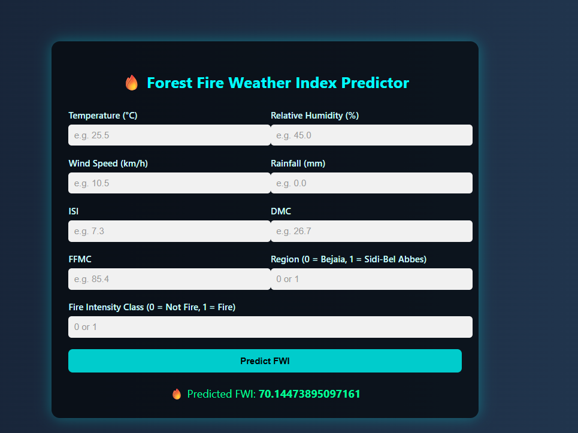
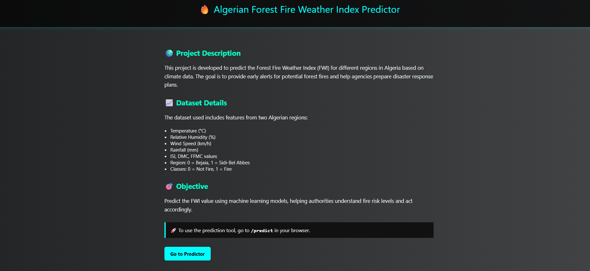

# 🔥 Algerian Forest Fire Weather Index Predictor

This project is a machine learning-based web application to predict the **Forest Fire Weather Index (FWI)** for regions in Algeria using environmental and meteorological data.

It helps authorities anticipate and respond to forest fire risks based on features like temperature, humidity, wind, and rainfall.

---

## 🌍 Project Overview

- 🔬 **Dataset:** Algerian Forest Fire Dataset (from UCI Machine Learning Repository)
- 🧠 **Model:** Regression model trained on weather and fire behavior indices
- 🌐 **Web App:** Built using Flask and rendered with HTML/CSS

---

## 🛠️ Features

- Predicts FWI based on user input (Temperature, RH, Wind, Rain, ISI, DMC, FFMC)
- Supports two regions: `Bejaia` and `Sidi-Bel Abbes` (encoded as 0 and 1)
- Classifies intensity: `Fire` or `Not Fire` (encoded as 1 and 0)
- User-friendly interface with styled HTML form
- Lightweight, fast, and easy to deploy locally

---

## 🚀 How to Run the Project

### 🔧 Requirements:
Install the dependencies:
```bash
pip install -r requirement.txt


▶️ Run the Flask App:
   python application.py

📂 Project Structure

Algerian-Forest-Fire-Predictor/
│
├── application.py
├── requirement.txt
├── README.md
├── templates/
│   ├── home.html
│   └── index.html
└── static/

💡 Input Details
 
Feature	                   Description
Temperature	           Ambient temperature in Celsius
RH	                      Relative Humidity (%)
Wind                      Speed	Wind speed (km/h)
Rainfall	                  Rain (mm)
ISI,                      DMC, FFMC	Fire behavior indices
Region           	     0 = Bejaia, 1 = Sidi-Bel Abbes
Classes	                   0 = Not Fire, 1 = Fire  


🧪 ML Workflow Summary

Data preprocessing using pandas and scikit-learn

Feature scaling with StandardScaler

Model trained using a regression algorithm

Model saved using pickle and used in Flask app




🧾 License
This project is intended for academic use only.

© 2025 Hritesh Bansal
